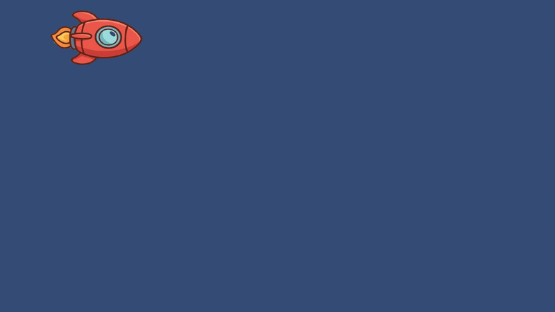
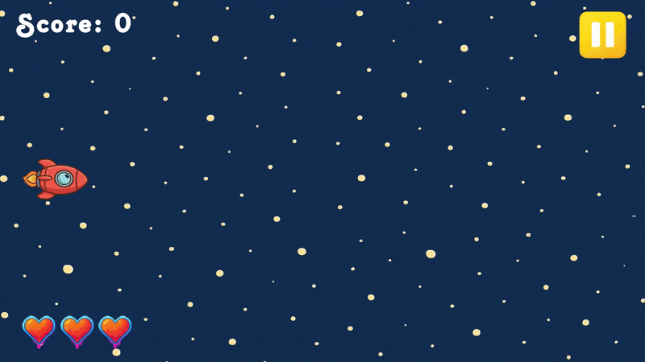

# RacketGame


## Description
I've started working on a new game. :D It's a recreation of a simple project I made in C++ around 5 years ago. In the original version, the idea was to control a racket and avoid asteroids, with each asteroid giving 10 points. In this new version, I'm turning it into a shooter-style game, where the enemies are alien cats. The main goal is to learn by practicing.

### Controls
- **Movement:** W/A/S/D or Arrow Keys  
- **Shoot:** Spacebar

## Used Technologies
- Unity + C#
- Visual Studio

## How to Run
1. Clone the repository:
   ```bash
   git clone https://github.com/SabeCiupi/RacketGame.git
2. Open the project in Unity
3. Run the main scene from the `Scenes` folder

---

## Development Log

| Update Description                                                                                                                          | Release Date  |
|---------------------------------------------------------------------------------------------------------------------------------------------|---------------|
| Implemented basic player mechanics, including top-down movement and shooting a horizontal projectile. Learned how to use Unity's Input System and Rigidbody2D for smooth directional control and how to instantiate objects using simple scripting. This serves as the core control scheme for the future game interactions. | July 4, 2025  |
| Added the game background, implemented player collision with enemies, as well as bullet collision with enemies. Introduced enemies moving horizontally, with randomized spawning points to enhance gameplay variability.                                                                                     | July 5, 2025  |
| Added a moving background featuring planets acting as tangible obstacles that move synchronously with the background. These obstacles are spawned randomly to increase gameplay complexity and visual interest. | July 12, 2025 |
| Implemented player health system with 3 lives, so the player loses a life upon collision with enemies or planets. Added screen boundary walls to prevent the player from moving outside the game window, ensuring better gameplay control and user experience. | August 24, 2025 |
| Implemented a visual health system UI using Canvas, displaying player lives as heart icons that update dynamically when the player takes damage or heals. Set up proper anchoring and layout to ensure hearts remain fixed on the screen regardless of resolution, integrating seamlessly with the existing HealthSystem script. | August 26, 2025 |
| Added scoring system, awarding 10 points for each cat enemy defeated. Implemented bullet collision with planets so that bullets stop upon impact without additional effects. Set up player life penalty: when a cat enemy passes beyond the player, it disappears and the player loses one life. | August 27, 2025 |
| Added new enemy types to diversify gameplay and increase challenge: ZigZag Cat, which moves in a zigzag pattern; Armored Cat, with 2 lives, each represented by a different prefab state; Chaser Cat, which actively follows the player’s position; and Runner Cat, moving at twice the speed of the Basic Cat. | August 28, 2025 |
| Added pause button with a pause menu, including a resume button to return to gameplay. | August 29, 2025 |
| Added functionality for the Restart button in the pause menu, and the Home button. Created a Main Menu with functional Play and Quit buttons. Gave the game its name: *Paws in Space*.| September 2, 2025 |


## Development Demos

### July 4, 2025 — Basic Player Mechanics



### July 5, 2025 — Enemies and Collision Mechanics


### July 12, 2025 — Moving Background and Obstacles


### August 24, 2025 — Player Health System and Screen Boundaries


### August 26, 2025 — Visual Health System UI


### August 27, 2025 — Scoring System and Bullet Collision


### August 28, 2025 — New Enemy Types 


### August 29, 2025 — Pause Menu with Resume Button 

<!-- ### September 2, 2025 — Restart & Home Buttons, Main Menu 
 -->
---

## Bibliography / Tutorials Used

- [BMo - 2D Top Down Movement UNITY Tutorial](https://www.youtube.com/watch?v=u8tot-X_RBI)
- [Distorted Pixel Studios - 2D Bullet / Projectiles in Unity / 2023](https://www.youtube.com/watch?v=8TqY6p-PRcs)
- [ChronoABI - Simple Wave spawner in Unity 2D](https://www.youtube.com/watch?v=pKN8jVnSKyM)
- [Root Games - Unity 2D: Scrolling Background](https://www.youtube.com/watch?v=Wz3nbQPYwss)
- [Night Run Studio - Player Health System #2: Heart Display UI (Unity Tutorial)](https://www.youtube.com/watch?v=uqGkNTFzYXM)
- [Rehope Games - How to Create a PAUSE MENU in Unity ! | UI Design Tutorial](https://www.youtube.com/watch?v=MNUYe0PWNNs&t=62s)

> These tutorials were essential in mastering core gameplay mechanics such as character movement, projectile behavior, and enemy wave spawning in Unity.
